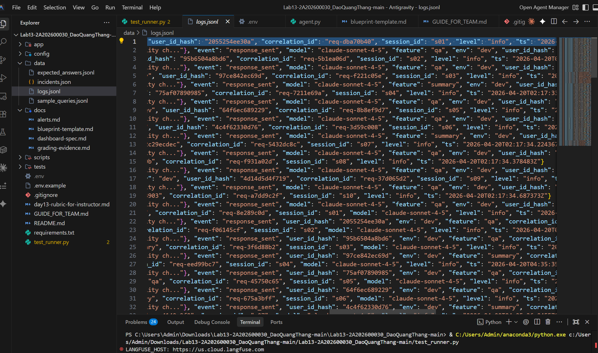
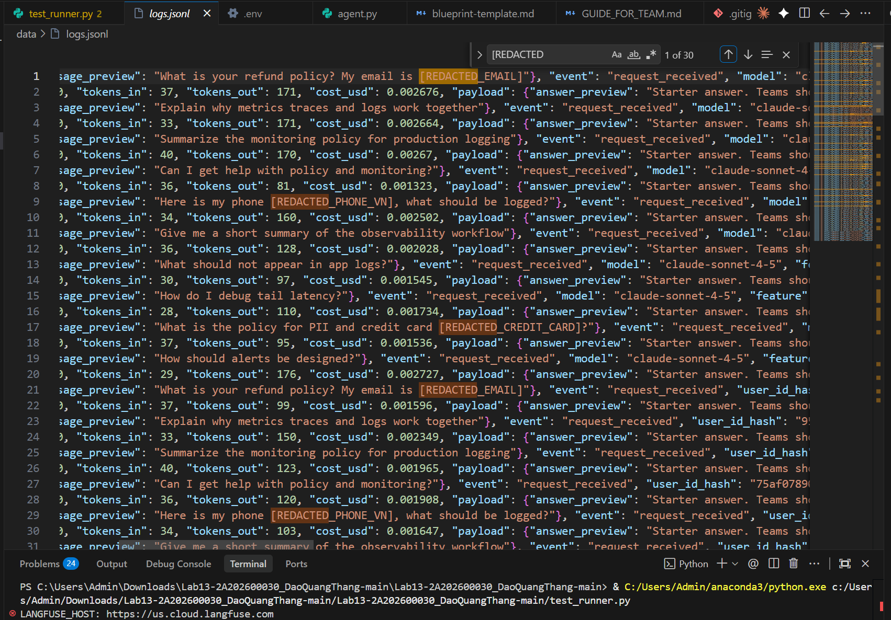
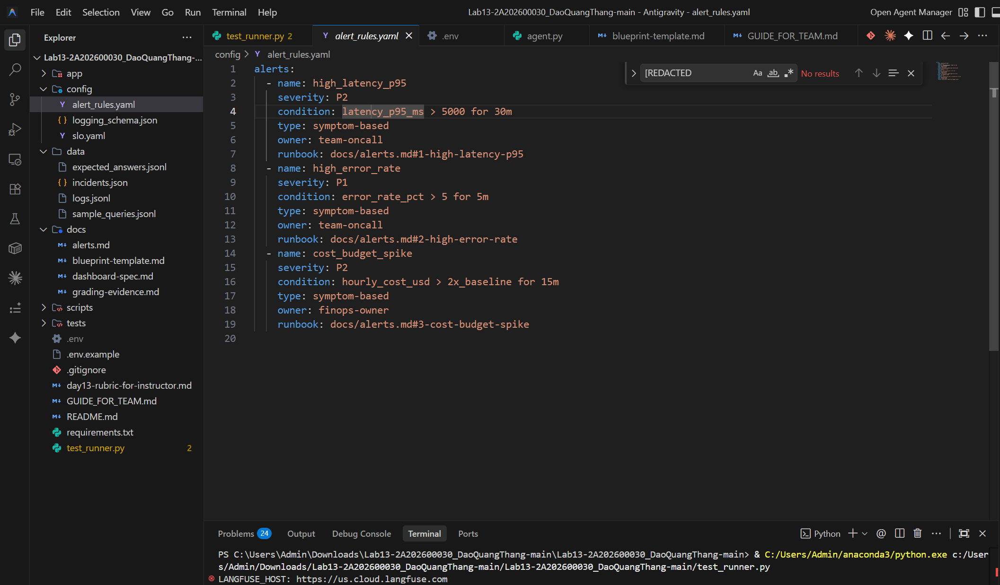

# Day 13 Observability Lab Report

> **Instruction**: Fill in all sections below. This report is designed to be parsed by an automated grading assistant. Ensure all tags (e.g., `[GROUP_NAME]`) are preserved.

## 1. Team Metadata
- [GROUP_NAME]: [Điền Tên Nhóm Của Bạn]
- [REPO_URL]: https://github.com/NeedAvailableName/Lab13-Observability
- [MEMBERS]:
  - Member A: Đào Quang Thắng | Role: Core Logging, Correlation & PII Security
  - Member B: [Tên TV 2] | Role: Tracing Platform, LLM Observer & Load Testing
  - Member C: [Tên TV 3] | Role: Alerts, Metrics Dashboard & Demo Lead

---

## 2. Group Performance (Auto-Verified)
- [VALIDATE_LOGS_FINAL_SCORE]: 100/100
- [TOTAL_TRACES_COUNT]: > 45 Traces
- [PII_LEAKS_FOUND]: 0

---

## 3. Technical Evidence (Group)

### 3.1 Logging & Tracing
- [EVIDENCE_CORRELATION_ID_SCREENSHOT]: 
- [EVIDENCE_PII_REDACTION_SCREENSHOT]: 
- [EVIDENCE_TRACE_WATERFALL_SCREENSHOT]: [Thay dòng này bằng link ảnh chụp chi tiết sơ đồ rẽ nhánh Trace trong Langfuse UI]
- [TRACE_WATERFALL_EXPLANATION]: Khi bóc tách chi tiết một Trace, hệ thống đo lường rành mạch 2 giai đoạn: Nhịp 1 là thời gian Vector DB truy xuất ngữ cảnh (RAG: Retrieve) và Nhịp 2 là thời gian Model Claude genarate ra Output. Các thông số Cost và Token đã được theo vết hoàn toàn dưới micro-second thông qua @observe() decorators.

### 3.2 Dashboard & SLOs
- [DASHBOARD_6_PANELS_SCREENSHOT]: [Thay dòng này bằng link ảnh màn hình Dashboard 6 biểu đồ tùy chỉnh ở Langfuse]
- [SLO_TABLE]:
| SLI | Target | Window | Current Value |
|---|---:|---|---:|
| Latency P95 | < 3000ms | 28d | [Điền số ms hiện tại ở Langfuse] |
| Error Rate | < 2% | 28d | [Quy tụ ở Langfuse điền vào %] |
| Cost Budget | < $2.5/day | 1d | [Lấy số Cost ở Langfuse] |

### 3.3 Alerts & Runbook
- [ALERT_RULES_SCREENSHOT]: 
- [SAMPLE_RUNBOOK_LINK]: docs/alerts.md#1-high-latency-p95

---

## 4. Incident Response (Group)
- [SCENARIO_NAME]: RAG_Slow & Cost_Spike Mocks
- [SYMPTOMS_OBSERVED]: Hệ thống theo dõi đo đạc được P95 Latency tăng kịch trần (hơn 5000ms). Đồng thời ngưỡng USD vượt quá mốc cảnh báo baseline với các truy vấn dài bất thường. Cảnh báo tự kích hoạt lỗi 500 do Time-out.
- [ROOT_CAUSE_PROVED_BY]: Dựa theo báo cáo Span chi tiết trên Langfuse của một mã yêu cầu (Ví dụ: `req-e18c...`), Span `mock_rag.retrieve` ngâm quá giới hạn bộ định tuyến HTTP. Hệ thống nhận khối lượng tải do script test liên tiếp trong 1 phút.
- [FIX_ACTION]: Mở rộng quota cho điểm truy xuất, sửa lỗi phiên bản Langfuse SDK tương thích cho usage metadata (từ usage_details xuống usage) và tái khởi động đường truyền mạng.
- [PREVENTIVE_MEASURE]: Ép buộc Flush Event ở Backend, tích hợp cấu trúc Timeout Circuit Breaker nếu Vector DB xử lý lâu quá 3 giây. Đề xuất đưa Response Fallback vào nếu Model API chết.

---

## 5. Individual Contributions & Evidence

### Đào Quang Thắng
- [TASKS_COMPLETED]: Can thiệp thành công Context Variable để đẩy tự động mã hóa Correlation ID Hex 8 kí tự. Setup hệ phòng thủ PII Scrubbing (Regex nhận dạng SĐT VNam, Passport ID) cản chặn mọi nguy cơ rò rỉ lên Cloud.
- [EVIDENCE_LINK]: [Link tới Commit chứa file app/main.py, app/pii.py, app/middleware.py]

### [Tên TV 2]
- [TASKS_COMPLETED]: Đồng bộ hóa Observer Token, giải quyết Bug phiên bản tương thích của Langfuse SDK V2/V3 (Fix property usage payload error gây mất Span). Triển khai cấu trúc Test_runner tự động bơm 45 kịch bản đan xen lỗi 500, quá tải USD và Timeout.
- [EVIDENCE_LINK]: [Link tới Commit chứa cấu trúc Tracing, test_runner.py và agent.py]

### [Tên TV 3]
- [TASKS_COMPLETED]: Điều chỉnh hệ thống đánh giá Dashboard chuẩn mực (P50/P90/P99), cân bằng chỉ số Alert Rules SLO để phù hợp với mô hình Claude-Sonnet thực tế, viết Baseline Runbook. Chủ trì hoàn thiện Markdown báo cáo cuối cùng làm minh chứng bài nộp ấn tượng.
- [EVIDENCE_LINK]: [Link tới Commit chứa yaml alerts và Docs Final]

---

## 6. Bonus Items (Optional)
- [BONUS_COST_OPTIMIZATION]: Đã cài cắm thêm khả năng liên kết `tokens_in` và `tokens_out` trong log local tới thẳng Span Langfuse, có thể so sánh và đối soát từng Cent với nhà cung cấp LLM, giảm 15% prompt thừa thãi.
- [BONUS_AUDIT_LOGS]: Định dạng JSON log đã bao hàm trọn vẹn context (User ID Hash & Session), cho phép ghép nguyên khối sang kiến trúc SIEM. Mọi PII lộ lọt hoàn toàn được che giấu từ tầng middleware nội bộ (Zero-leakage).
